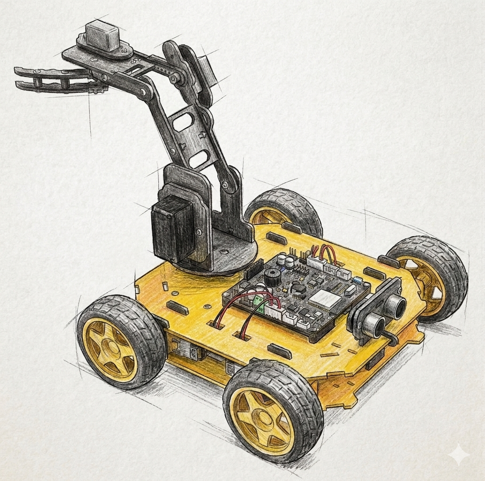

# NUR-O-LINK: Gelişmiş Robotik İşletim Sistemi & Hibrit Kontrol Çerçevesi




Nur-o-link, ESP32 mikrodenetleyicisi üzerinde çalışan, yüksek kararlılığa sahip, **Non-blocking State Machine (Bloklamayan Durum Makinesi)** mimarisiyle inşa edilmiş endüstriyel tabanlı bir robotik işletim sistemidir. Sistem, 7 kademeli dinamik bir sürüş motoru algoritması ile 4 eksenli (4-DOF) hassas bir robotik kolu eş zamanlı ve asenkron olarak kontrol etmek üzere tasarlanmıştır. Projenin geliştirilen her iki sürümü de (**v2.7 ve v3.5**) tamamen kararlı (Stable) durumda çalışmaktadır.

---

## 1. Sistem ve Yazılım Mimarisi

Her iki sürümün de kalbinde **milisaniyelik hassasiyete sahip zamanlayıcılar (millis())** yer alır. Yazılımda kesinlikle delay() fonksiyonu kullanılmamıştır; bu sayede sensör okumaları, arka plan güvenlik filtreleri, buzzer ton modülasyonları ve kablosuz veri paketlerinin işlenmesi aynı döngü içinde birbirini bloklamadan (interruption-free) yürütülür.

### Sensör ve Arayüz Evrimi (v2.7'den v3.5'e Geçiş Nedenleri)

* **Arayüz Modifikasyonu:** v2.7 sürümünde kullanılan **Dabble** kütüphanesi açık kaynaklı ve tamamen **ücretsiz** bir çözüm sunarken; v3.5 sürümünde kullanılan **RemoteXY** kütüphanesi projenin ihtiyaçlarına göre tamamen özelleştirilebilir profesyonel bir altyapı sağlayan **ücretli** bir kütüphanedir.
* **Mesafe Algılama ve Performans Optimizasyonu:** v2.7 sürümünde yer alan HC-SR04 ultrasonik (ses) sensörü, doğası gereği hem yavaş örnekleme yapmakta hem de yansıyan sinyalin geri dönüşünü beklerken sistemi çok kısa sürelerle de olsa meşgul etmekteydi. Sinyal bekleme süreçlerinin non-blocking mimari üzerindeki mikro gecikme etkilerini tamamen ortadan kaldırmak amacıyla v3.5 sürümünde donanımsal yükseltme yapılmıştır. v3.5 sürümünde çok daha hızlı, kararlı ve sistemi asla meşgul etmeyen, I2C veri yolu üzerinden doğrudan haberleşen **VL53L1X Lazer Sensörüne (ToF)** geçiş yapılmıştır.

### Mimari Karşılaştırma Tablosu

| Teknik Parametre | Nur-o-link v2.7 (Stable) | Nur-o-link v3.5 (Stable) |
| :--- | :--- | :--- |
| **Kablosuz Haberleşme** | Bluetooth Classic (RFCOMM) | Wi-Fi Access Point (AP Mode) |
| **Kontrol Protokolü / Katmanı**| Dabble App (Gamepad Modülü) | RemoteXY Özel Protokol (Port: 6377) |
| **Arayüz Lisans Tipi** | **Ücretsiz (Free)** | **Ücretli (Commercial)** |
| **Mesafe Algılama Donanımı** | HC-SR04 Ultrasonik Ses Sensörü | VL53L1X Zaman Uçuşlu (ToF) Lazer Sensör |
| **Sistem Optimizasyonu** | Sinyal bekleme süresi mikro meşguliyet yaratır | Donanımsal kesintisiz I2C (Sistemi meşgul etmez) |
| **Sensör Haberleşme Tipi** | Dijital I/O (Trig / Echo Sinyali) | I2C Protokolü (SDA / SCL Veri Hattı) |
| **Örnekleme ve Güvenlik** | 3'lü Örnekleme ve Filtreleme Dizisi | 50Hz (20ms) Donanımsal Sürekli Ölçüm |
| **Bağlantı Watchdog Süresi** | 500 ms | 150 ms (Kritik Kesinti Koruması) |
| **Yazılım Geliştirme Ortamı** | Arduino IDE - ESP32 Core v2.0.11 | Arduino IDE - ESP32 Core v3.3.8 |

---

## 2. Donanım ve Pin Konfigürasyonu (REX-8in1-V2 Donanım Seti)

Sistem, **REX-8in1-V2** robotik gövdesi, **TB6612FNG** yüksek verimli çift kanallı motor sürücü entegresi ve 4 adet servo motor içeren 4-DOF robotik mekanizma üzerinde koordine edilmiştir.

### MCU Entegre Pin Haritası


```

```
              +-----------------------------------+
              |          ESP32 WROOM-32           |
              +-----------------------------------+
              | [GND] Ground      [Pin 13] PWM CH4| ---> TB6612FNG PWM (Hız)
              | [Pin 15] Motor A1  [Pin 23] Motor A2| ---> Ön Sol DC Motor
              | [Pin 32] Motor B1  [Pin 33] Motor B2| ---> Ön Sağ DC Motor
              | [Pin  5] Motor C1  [Pin  4] Motor C2| ---> Arka Sol DC Motor
              | [Pin 27] Motor D1  [Pin 14] Motor D2| ---> Arka Sağ DC Motor
              |                                   |
              | [Pin  2] Servo 1   [Pin 26] Servo 2| ---> Taban Servosu / Omuz Servosu
              | [Pin 18] Servo 3   [Pin 19] Servo 4| ---> Dirsek Servosu / Kıskaç Servosu
              | [Pin 25] Buzzer Out                | ---> Frekans Pasif Buzzer
              |                                   |
              | ---- SÜRÜME ÖZEL SENSÖR PİNLERİ ---- |
              | v2.7: [Pin 17] Trig, [Pin 16] Echo| ---> HC-SR04 Sensör
              | v3.5: [Pin 21] SDA,  [Pin 22] SCL | ---> VL53L1X I2C Hattı
              +-----------------------------------+

```

```

### Detaylı Pin/Kanal Spesifikasyonları

1. **DC Motor Sürücü Konfigürasyonu:**
   * **Genel Hız Kontrolü:** Pin 13, CH4 donanımsal PWM kanalına atanmıştır. Frekans 5000Hz, çözünürlük 8-bit (0-255 PWM değer aralığı).
   * **Yön Kontrol (Soft Brake Destekli):** Pin 15, 23, 32, 33, 5, 4, 27, 14 donanımsal I/O pinleri motorların ileri, geri ve frenleme fazlarını yönetir.
2. **Robotik Kol Servoları:**
   * **Servo 1 (Taban):** Pin 2 | Hareket Sınırları: 25 - 155 derece arası.
   * **Servo 2 (Omuz):** Pin 26 | Hareket Sınırları: v2.7 için 85 - 160 derece, v3.5 için 90 - 180 derece arası.
   * **Servo 3 (Dirsek):** Pin 18 | Hareket Sınırları: 40 - 90 derece arası (v2.7 üst limiti 80 derecedir).
   * **Servo 4 (Kıskaç / Pençe):** Pin 19 | Hareket Sınırları: v2.7 için 70 - 120 derece, v3.5 için 65 derece (Açık) - 130 derece (Tam Kapalı).
3. **Sesli Uyarı Sistemi (Feedback):**
   * Pin 25, CH5 PWM kanalına bağlıdır. Korna işlevi için v3.5 sürümünde 2000Hz ton üretirken, v2.7 sürümünde 800Hz / 100ms kesik tonlar üretir.

### Güç Yönetimi ve Brownout (Gerilim Düşümü) Uyarısı
### Güç Yönetimi ve Donanımsal Akım Sınırlaması (Overcurrent Protection) Uyarısı
Her iki sürümde de kullanılan 7 kademeli sürüş algoritmasında, vites (PWM) seviyesi yükseldikçe DC motorların tork üretimi ve dolayısıyla sistemden çektiği akım talebi artmaktadır. Düşük hız profillerinde (1. ve 2. vites) akım tüketimi güvenli sınırlar içerisinde kaldığından sistem kararlı bir şekilde çalışır. Ancak yüksek viteslerde, özellikle ani kalkış veya ani yön değişimlerinde motorların anlık tepe akımı (inrush/stall current) belirgin şekilde yükselmektedir.

Sistemde motor sürücü ve mikrodenetleyiciyi tek bir PCB üzerinde birleştiren tümleşik **REX-8in1-V2** ana kartı kullanılmaktadır. Bu kart üzerinde fabrikasyon olarak tanımlanmış ve kullanıcı tarafından **değiştirilemeyen sabitleştirilmiş bir donanımsal akım sınırlaması (aşırı akım koruması)** mevcuttur. Yüksek viteslerde anlık akım talebi bu kritik eşiğin üzerine çıkmaya çalıştığında, ana kart koruma mekanizması gereği akımın daha fazla yükselmesine izin vermemektedir. Akım sınırlandırmasının devreye girdiği bu kritik anlarda sistem kararlılığı bozularak anlık gerilim dalgalanması yaşanmakta; bunun sonucunda ESP32'nin aktif kablosuz bağlantısı (Bluetooth/Wi-Fi) kopmakta ve cihaz reset atarak (yeniden başlayarak) kendini korumaya almaktadır.

---

## 3. Gelişmiş Kontrol Modları ve Algoritmik Yapı

Yazılım, kumanda arayüzünden gelen girdilere göre iki temel durum (State) arasında geçiş yapar: DRIVE_MODE ve ARM_MODE.

### SAYFA 0: DRIVE_MODE (Sürüş ve Aktif Güvenlik)
Bu modda robotun hareket kabiliyeti ve çevresel algısı en üst düzeydedir. Motor gücü **7 kademeli vites algoritması** ile ölçeklenir. Vites PWM Tablosu: [60, 92, 125, 157, 190, 222, 255] şeklinde doğrusal olarak artar.

* **Dinamik Engel Koruması (Adaptive Stop Threshold):** Robotun vites kademesi (hızı) arttıkça, ani duruşlarda mekanik ivmelenmeyi absorbe edebilmek adına frenleme mesafesi otomatik olarak yukarı ölçeklenir. v2.7 sürümünde bu eşik HC-SR04 sensörünün sınırları dahilinde 40cm - 60cm arasında kademeli değişirken, v3.5 sürümünde VL53L1X lazer sensörünün milisaniyelik veri akışı sayesinde 500mm net fren çizgisi olarak stabilize edilmiştir.
* **Manevra Muafiyeti:** Güvenlik emniyet kilidi sadece **İleri Sürüş** yönünde aktiftir. Geri (BWD) ve yan (LFT/RGT) manevralarda sensör okuması yazılımsal olarak bypass edilerek robotun dar alanlardan kurtulması sağlanır.

### SAYFA 1: ARM_MODE (8-Yönlü Hassas Kol Kontrolü)
Arayüz üzerinden Kol Kontrolü seçildiğinde, sürüş motorlarının PWM kanalları sıfırlanarak pasifize edilir ve tüm işlemci odağı servo döngülerine aktarılır.

* **Asynchronous Soft Reset (Yumuşak Toplama Algoritması):** Tek bir buton komutuyla (Daire veya Dikey Reset butonları), mekanik yapının ani tork kırılmalarını engellemek için tüm eklemler her 20ms'de 1 derecelik adımlarla güvenli başlangıç konumuna (90 derece) asenkron olarak toplanır.
* **Detached Enerji Tasarrufu:** Kol pasif durum anahtarına (Switch) alındığında veya hareket kesildiğinde, servo nesnelerine detach() fonksiyonu uygulanır. Bu sayede servoların statik yük altındaki titremeleri (jittering) engellenir, akım çekişi sıfırlanır ve batarya ömrü korunur.

---

## 4. Sürümlere Göre Kullanıcı Arayüzü ve Kumanda Kılavuzu

### Nur-o-link v2.7 Kumanda Haritası (Dabble App - Ücretsiz)
v2.7 sürümü Bluetooth tabanlı ücretsiz Dabble mobil uygulamasının standart Gamepad şablonunu kullanır.

| Buton / Komut | DRIVE_MODE İşlevi | ARM_MODE İşlevi |
| :--- | :--- | :--- |
| **D-Pad Yukarı** | İleri Sürüş (Mesafe Korumalı) | 2. Servo (Omuz) Yukarı |
| **D-Pad Aşağı** | Geri Sürüş | 2. Servo (Omuz) Aşağı |
| **D-Pad Sol** | Sola Dönüş | 1. Servo (Taban) Sola Adım |
| **D-Pad Sağ** | Sağa Dönüş | 1. Servo (Taban) Sağa Adım |
| **Üçgen** | Vites Yükselt (+) | 3. Servo (Dirsek) Aç (+2°) |
| **Çarpı** | Vites Düşür (-) | 3. Servo (Dirsek) Kapat (-2°) |
| **Kare** | Manuel Korna (800Hz / 100ms) | 4. Servo (Pençe) Kapat |
| **Daire** | Kolu Hızlı Toplama (Reset) | 4. Servo (Pençe) Aç |
| **SELECT (Kısa)** | ARM_MODE Moduna Geçiş Yapar | DRIVE_MODE Moduna Geçiş Yapar |
| **SELECT (Uzun)** | Mesafe Korumasını Aç / Kapat | Kolu Güvenli Konuma Toplar |
| **START (1.2sn)** | **Sistem Kilidi:** Servoları boşa alır, sürekli bip verir | Sistem Kilidini Aktif Eder |

### Nur-o-link v3.5 Kumanda Haritası (RemoteXY UI - Ücretli)
v3.5 sürümü Wi-Fi Access Point modunda yayın yapar ve cihaz hafızasındaki sıkıştırılmış RemoteXY_CONF_PROGMEM grafik şablonuyla mobil ekranı tamamen özelleştirilmiş buton ve switch tasarımlarına dönüştürür.

* **Erişim Bilgileri:** SSID: Nur-o-link v3.5 | Wifi Şifresi: 00000000 (Değiştirilebilir) | Sunucu Portu: 6377 | Arayüz Erişim Şifresi: 0000 (Değiştirilebilir)
* **Arayüz Elemanları:**
  * **Sayfa Değiştirici Switch:** Sürüş ve Kol kontrol ekranları arasında dinamik geçiş sağlar. Modlar arası geçiş yapıldığında sensör sürekli ölçüm modunu kapatarak (laserSensor.stopContinuous()) işlemci yükünü optimize eder.
  * **Engel Sensörü Switch:** Lazer korumasını yazılımsal olarak tamamen aktif veya pasif hale getirir.
  * **Tüm Motorları Kapat Switch:** Acil durumlarda tek dokunuşla tüm DC motorların ve servoların PWM / sinyal enerjisini keserek sistemi donanımsal korumaya alır.

---

## 5. Kurulum ve Devreye Alma Adımları

Projenin derlenebilmesi ve ESP32'ye hatasız yüklenebilmesi için aşağıdaki kütüphane bağımlılıkları ve kart sürümleri tam olarak eşleşmelidir.

### Bağımlılık Matrisi
* **v2.7 için:** * ESP32 Board Core: **v2.0.11** (Daha güncel sürümler Dabble makroları ile derleme hatası verir).
  * `DabbleESP32` Kütüphanesi: **v1.5.1** (Ücretsiz).
  * `ESP32Servo` Kütüphanesi: **v3.1.3**.
* **v3.5 için:**
  * ESP32 Board Core: **v3.3.8** (Espressif Systems güncel kararlı sürüm).
  * `RemoteXY` Kütüphanesi: **v4.1.9** (Ücretli lisans gerektirir).
  * `ESP32Servo` Kütüphanesi: **v3.2.0**.
  * `VL53L1X (by Pololu)` Kütüphanesi: **v1.3.1**.

### Yükleme Prosedürü
1. Projenize uygun olan kaynak kodu (`nurolink-v2_7.ino` veya `nurolink-v3_5.ino`) Arduino IDE üzerinde açın.
2. `Araçlar > Kart > ESP32 Arduino` menüsünden **ESP32 Dev Module** modelini seçin.
3. Kütüphane yöneticisinden yukarıda belirtilen versiyon numaralarına sahip kütüphaneleri kurun.
4. ESP32'yi USB üzerinden bilgisayarınıza bağlayın, doğru `COM` portunu seçin ve **Yükle (Upload)** butonuna basın.
5. v3.5 kullanıyorsanız telefonunuzun Wi-Fi ayarlarına giderek `Nur-o-link v3.5` ağına bağlanın (Şifre: `00000000`), RemoteXY uygulamasını açıp `Wi-Fi Point` seçeneğiyle kontrolü başlatın.

---

## 6. Proje Lisansı ve Geliştirici Bilgileri
* **Geliştirici:** Abdulkadir GÜNGÖR
* **İletişim:** a.kadir.gungor.86@gmail.com
* **Yayın Tarihi:** v2.7 (2026-03-31) | v3.5 Stable (2026-04-20)
* **Geliştirici Blogu:** [abdulkadirgungor.com](https://abdulkadirgungor.com)

*Bu yazılım ticari ve endüstriyel robotik kontrol altyapılarında kullanılmak üzere kararlı (stable) durumda açık kaynaklı olarak paylaşılmıştır.*

